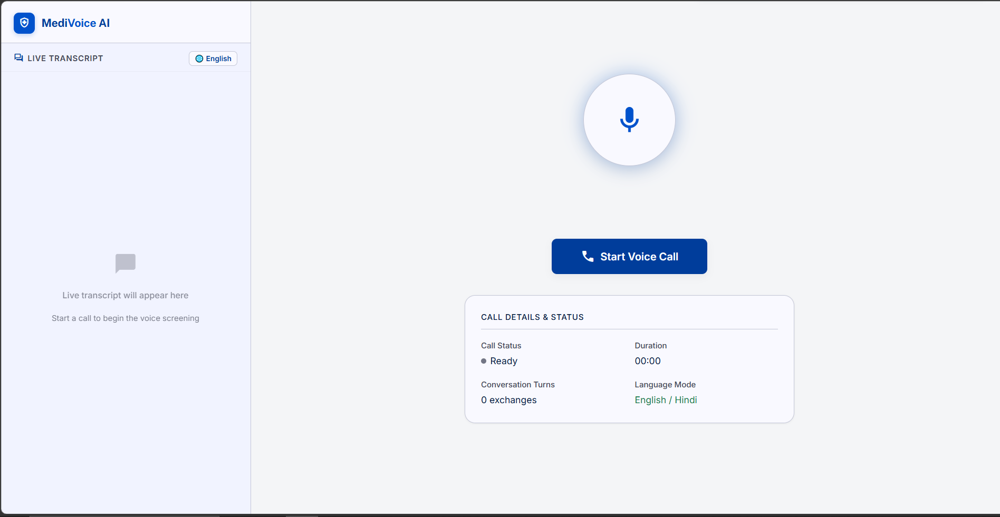
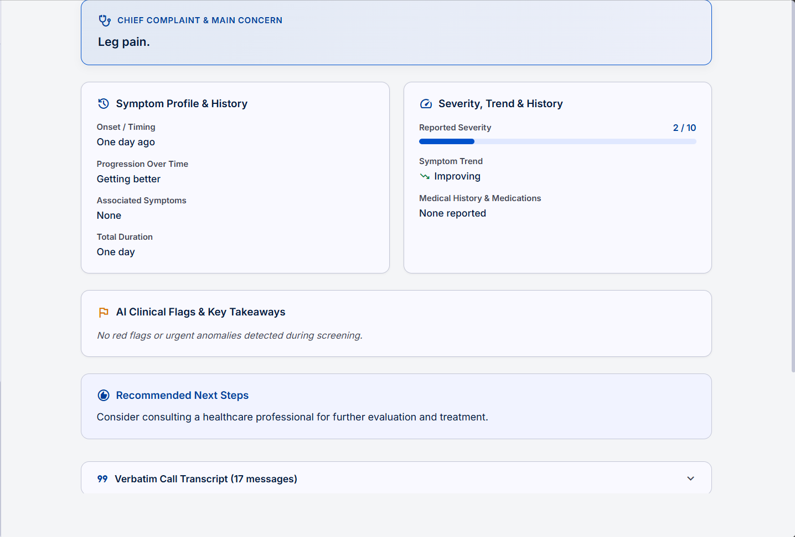

# MediVoice AI – Voice Health Screener

A full-stack, real-time AI voice health screening web application built with **React** (frontend) and **Node.js** (backend). Patients have natural, hands-free voice conversations with an empathetic AI clinical intake assistant in English, Hindi, or any of 18+ regional and international languages. Upon call completion, the platform automatically generates a doctor-ready, structured health screening report adhering to clinical intake standards.

---

## 📸 Screenshots & Demo

### 1. Live Voice Screening & Visualizer Interface

*Real-time voice orb animation, adaptive live transcript in detected language, multi-language mode switcher, and hands-free microphone listening.*

### 2. Structured Clinical Health Report

*Instant doctor-ready intake summary generated upon call end: Intake Quality Badge, Chief Complaint, Symptom Profile (Onset, Progression, Associated Symptoms), 0–10 Pain Severity Gauge & Trend, AI Clinical Flags & Triage Alerts, Physician Recommended Actions, and Full Verbatim Transcript.*

---

## 🚀 Key Features

- 🎙️ **Natural Voice Interaction**: Real-time voice call with low latency, voice visualizer orb, and hands-free automatic turn-taking with VAD (Voice Activity Detection).
- 🌐 **Multilingual Support (18+ Languages)**: Auto-detects and seamlessly adapts to **English, Hindi (हिन्दी), Marathi (मराठी), Bengali (বাংলা), Tamil (தமிழ்), Telugu (తెలుగు), Gujarati (ગુજરાતી), Kannada (ಕನ್ನಡ), Malayalam (മലയാളം), Punjabi (ਪੰਜਾਬੀ), Urdu (اردو), Spanish, French, German, Arabic, Chinese, Japanese, Russian, Portuguese**, etc.
- 📋 **Doctor-Ready Structured Report**: Automatically generated at the end of the call, complete with Chief Complaint, Symptom History, Pain Scale (0–10), AI Clinical Alerts, Physician Next Steps, and Collapsible Verbatim Transcript.
- 🔄 **Resume & Continue Session**: One-click "Restart Call" button continues seamlessly from previous conversation context without losing past medical intake.
- ⏱️ **Automatic Call Completion**: AI detects when screening is complete, delivers a warm closing statement, and automatically finishes the call to present the health report.
- 📱 **Modern Clinical UI**: Clean medical aesthetic built with Stitch design system tokens, Material Symbols, responsive layouts, and print/export tools.

---

## 🏗️ Architecture

```
Browser (React + Vite)
  │  WebSocket (ws://localhost:3001)
  ▼
Node.js/Express Backend
  ├── WebSocket Server – Manages active session state & real-time turn-taking
  ├── STT: Groq Whisper API (whisper-large-v3-turbo) + Browser Web Speech API
  ├── LLM: Groq Llama 3.3 70B (llama-3.3-70b-versatile) for adaptive clinical screening & structured JSON report
  └── TTS: Universal Neural TTS (Google TTS + Web Speech Synthesis fallback)
```

---

## 🛠️ Tech Stack

| Layer | Technology | Description |
|---|---|---|
| **Frontend** | React 19, Vite, React Router v6 | Real-time voice canvas, Canvas VoiceOrb, Transcript panel, Report view |
| **Backend** | Node.js, Express, `ws` (WebSocket) | Full-duplex audio binary and JSON messaging server |
| **STT (Speech-to-Text)** | Groq Whisper `whisper-large-v3-turbo` + Web Speech API | Dual-engine transcription with multilingual acoustic recognition |
| **LLM (Intelligence)** | Groq Llama 3.3 70B (`llama-3.3-70b-versatile`) | Fast, adaptive clinical triage persona and JSON report extraction |
| **TTS (Text-to-Speech)** | Universal Neural TTS (`google-tts-api` + SpeechSynthesis) | Dialect-accurate neural speech in Devanagari, Dravidian, and Latin scripts |
| **Language** | JavaScript (ESM + Node.js CommonJS) | Clean modern JavaScript throughout |

---

## ⚙️ Prerequisites & Setup

### Prerequisites:
- **Node.js** v18 or higher
- **Groq API Key** (Free tier from [console.groq.com](https://console.groq.com))
- Modern web browser (Google Chrome, Microsoft Edge, Brave, etc.) with microphone access

---

### Setup Instructions:

#### 1. Clone & Navigate
```bash
git clone <repo-url>
cd Acciojob
```

#### 2. Configure Environment Variables
```bash
# In the server directory
cp server/.env.example server/.env
```
Open `server/.env` and add your **Groq API Key**:
```env
GROQ_API_KEY=gsk_your_groq_api_key_here
PORT=3001
LLM_MODEL=llama-3.3-70b-versatile
```

#### 3. Install Dependencies
```bash
# Server dependencies
cd server
npm install

# Client dependencies
cd ../client
npm install
```

#### 4. Run the Application

Open two terminal windows:

**Terminal 1 (Backend Server):**
```bash
cd server
node index.js
```
*Server runs on `http://localhost:3001` and WebSocket on `ws://localhost:3001`.*

**Terminal 2 (Frontend Client):**
```bash
cd client
npm run dev
```
*Vite client runs on `http://localhost:5173`.*

Open **[http://localhost:5173](http://localhost:5173)** in your browser and grant microphone permissions when prompted.

---

## 📖 How to Use

1. Click **Start Voice Call** on the screening canvas.
2. The AI clinical assistant introduces itself and asks the first intake question.
3. Speak naturally in your preferred language (English, Hindi, Marathi, etc.).
4. The AI listens, transcribes your speech in real time, and responds conversationally with natural voice.
5. Once all screening questions are answered, the call completes automatically, and the **Structured Clinical Health Report** is displayed.
6. You can copy the clinical summary, print/export the report, restart the call to continue the conversation, or start a new call.

---

## 📁 Project Structure

```
Acciojob/
├── client/
│   ├── public/
│   │   ├── Voices.png          # Screenshot: Live Call Voice Visualizer
│   │   └── Report.png          # Screenshot: Structured Health Report
│   ├── src/
│   │   ├── components/
│   │   │   ├── Navbar.jsx          # Top application bar with status
│   │   │   ├── Sidebar.jsx         # Navigation sidebar
│   │   │   ├── VoiceOrb.jsx        # Smooth canvas audio reactive visualizer
│   │   │   ├── TranscriptPanel.jsx # Multilingual live transcript panel
│   │   │   └── ReportView.jsx      # Doctor-ready health report component
│   │   ├── hooks/
│   │   │   ├── useWebSocket.js     # Full-duplex WebSocket client
│   │   │   └── useAudioRecorder.js # Microphone media stream capture
│   │   ├── pages/
│   │   │   ├── LiveScreening.jsx   # Main call canvas & report switcher
│   │   │   └── HealthSummary.jsx   # Dedicated health report route
│   │   ├── App.jsx
│   │   └── index.css               # Clinical design tokens and styles
│   └── vite.config.js
└── server/
    ├── services/
    │   ├── stt.js                  # Groq Whisper Speech-to-Text
    │   ├── llm.js                  # Llama 3.3 70B clinical prompt & JSON report
    │   └── tts.js                  # Neural multilingual TTS service
    ├── sessionManager.js           # Session history and state store
    └── index.js                    # Express and WebSocket server
```

---

## 📄 Assessment Requirements Checklist

- [x] **Live Voice Conversation**: Hands-free conversation over WebSocket with turn-taking and voice visualizer.
- [x] **Adaptive AI Intake**: One-at-a-time questions covering complaint, onset, duration, severity (0–10), and related symptoms.
- [x] **Multilingual Support**: Supports English, Hindi, Marathi, and 18+ languages with dynamic script detection.
- [x] **Structured Health Report**: Doctor-ready summary with chief complaint, severity gauge, AI triage alerts, and doctor recommendations.
- [x] **Graceful Handling of Short Calls**: Partial/minimal intake quality indicators for short or interrupted sessions.
- [x] **Call Continuation**: Seamless resumption of past conversation history on call restart.
